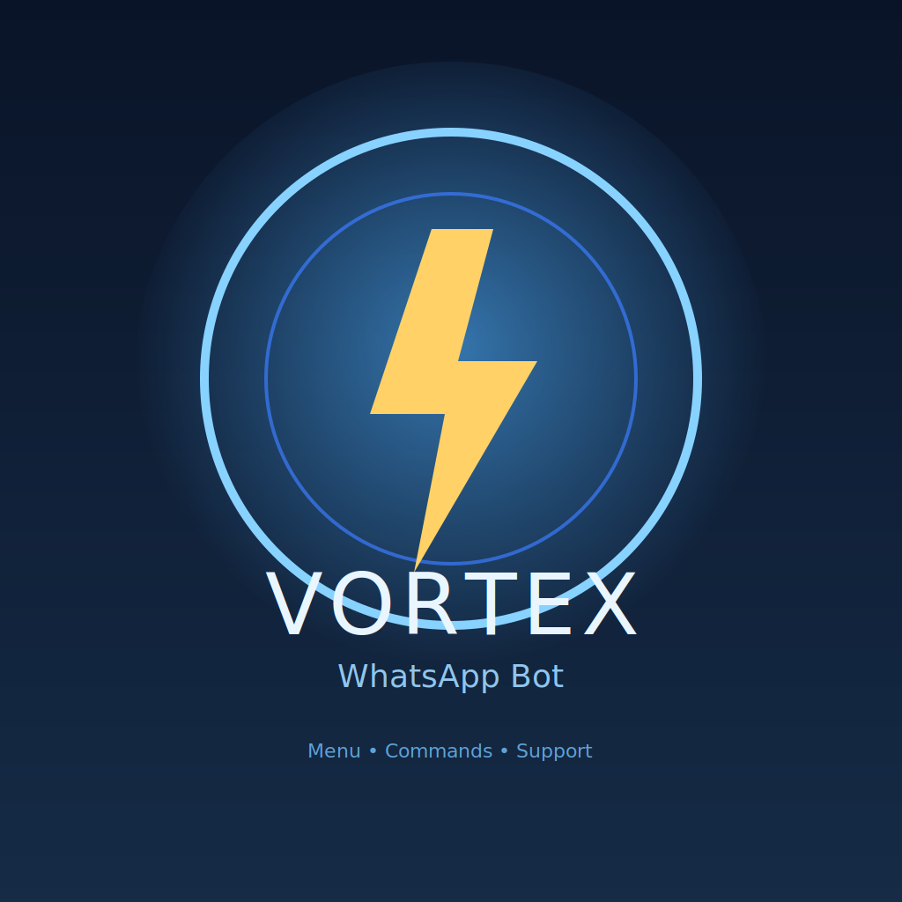

<!-- Vortex Bot | Modern Profile README  -->

  

<h1 align="center">Hi 👋, I'm Anonymous</h1>
<h3 align="center">💻 Passionate Developer | Exploring the Boundless World of Technology 🌍</h3>

  <a href="https://wa.me/263789544743" target="_blank">
    
    <strong> Vortex Bot</strong>
  </a>

  

---

## 🌐 Deploy

### Heroku

### Other Platforms
- Railway
- Render
- DigitalOcean
- AWS
- Self-hosted

## 🤝 Contributing

Contributions are welcome! Please feel free to submit a Pull Request.

## 📄 License

This project is licensed under the MIT License.

## 👨‍💻 Developer

**Anonymous**

- GitHub: [@Anonymous](https://github.com/anonymousofficial26)
- WhatsApp Channel: [Join Channel](https://whatsapp.com/channel/0029Vb7VSm62f3EAZILJ550J)

## 💬 Support

For support, join our [WhatsApp Channel](https://whatsapp.com/channel/0029Vb7VSm62f3EAZILJ550J) or open an issue on GitHub.

---

**© 2026 Vortex. Powered by Zuka. All rights reserved.**

Made with ❤️ by Anonymous

---

⭐ **Thank you for visiting my profile!** 🙌  
*Keep learning, keep building, and keep growing 🚀*
